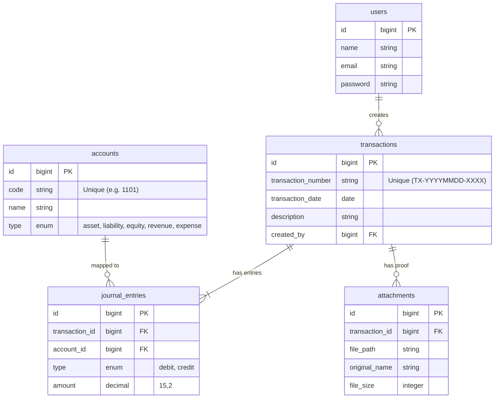

# Dokumentasi Proyek Keuangan Perusahaan (`finance-sys` & `finance_mobile`)

**Tanggal & Waktu Dokumen:** Sabtu, 4 Juli 2026 - 22:26:09 WIB (+07:00)  
**Status Proyek:** Tahap 1, 2, dan 3 Selesai (Backend, Web Dashboard, Ekspor, & Flutter Mobile Client)

---

## 1. Deskripsi Proyek
Proyek ini adalah sistem kontrol keuangan terpadu yang dirancang khusus untuk perusahaan rintisan (startup). Sistem ini mencatat setiap transaksi uang masuk (cash-in) dan uang keluar (cash-out) menggunakan prinsip dasar akuntansi **Double-Entry Bookkeeping (Pencatatan Berpasangan)**. 

Meskipun antarmuka pengguna (UI) dirancang sesederhana mungkin (hanya menginput nominal, kategori, dan foto bon), di belakang layar sistem secara otomatis memetakan transaksi tersebut ke dalam Debit dan Kredit pada **Bagan Akun (Chart of Accounts / COA)**. Hal ini memastikan database siap digunakan untuk menghasilkan laporan Buku Besar (General Ledger) dan Neraca di masa mendatang.

---

## 2. Arsitektur Sistem

### 2.1 Backend & Database
- **Framework:** Laravel 11 / 13
- **Database:** MySQL (Nama Database: `finance_sys`)
- **Autentikasi API:** Laravel Sanctum (Token-based)
- **Penyimpanan Berkas:** Local Storage (Folder `storage/app/public/receipts/`) dengan link simbolik ke `public/storage/` agar dapat diakses via URL publik.

### 2.2 Frontend Web (Dashboard)
- **Teknologi:** Laravel Blade Template, Vanilla CSS, & Vanilla JS (Tanpa Framework/Tailwind untuk kebebasan desain).
- **Desain UI:** *Premium Dark Mode* dengan tema *Glassmorphism* (`backdrop-filter: blur`), gradasi indigo-emerald, kartu metrik KPI, form transaksi berbasis modal interaktif, dan pratinjau instan berkas nota sebelum diunggah.
- **Fitur Ekspor:**
  - **Ekspor Excel (CSV):** Mengunduh file `.csv` dengan UTF-8 BOM agar terbaca rapi di Microsoft Excel.
  - **Ekspor PDF:** Menggunakan fungsi cetak bawaan browser (`window.print()`) yang dikontrol oleh CSS cetak khusus (`@media print`) sehingga menghasilkan cetakan laporan yang bersih tanpa tombol/form.

### 2.3 Aplikasi Mobile Client
- **Framework:** Flutter 3.38.1 (Dart 3.10.0)
- **Paket Dependensi:**
  - `http` & `http_parser` (Panggilan API & upload multipart)
  - `shared_preferences` (Penyimpanan token lokal)
  - `image_picker` (Akses kamera/galeri untuk memfoto bon bukti pembayaran)
  - `file_picker` & `path_provider` (Pengelolaan dokumen penunjang)

---

## 3. Struktur Database & Model Akuntansi

Penerapan akuntansi double-entry diimplementasikan melalui struktur tabel relasional berikut:



### 3.1 Logika Posting Jurnal Otomatis

| Jenis Transaksi | Akun yang Di-debit | Akun yang Di-kredit | Deskripsi |
|---|---|---|---|
| **Uang Keluar (Expense)** | Akun Kategori Beban (e.g. `5103` - Beban Server) | Akun Pembayaran Aset (e.g. `1102` - Bank BCA) | Menambah beban di sisi Debit, mengurangi kas di sisi Kredit. |
| **Uang Masuk (Revenue)** | Akun Pembayaran Aset (e.g. `1101` - Kas Utama) | Akun Kategori Pendapatan (e.g. `4101` - Pendapatan Utama) | Menambah kas di sisi Debit, menambah pendapatan di sisi Kredit. |

---

## 4. Bagan Akun Default (Chart of Accounts - COA)

Akun-akun bawaan yang disediakan otomatis oleh sistem saat instalasi awal:

| Kode Akun | Nama Akun | Tipe Akun | Keterangan |
|---|---|---|---|
| **1101** | Kas Utama | Asset | Kas tunai yang dipegang perusahaan |
| **1102** | Bank Mandiri/BCA | Asset | Rekening bank operasional |
| **1201** | Piutang Usaha | Asset | Tagihan ke klien |
| **2101** | Utang Usaha | Liability | Kewajiban pembayaran ke vendor |
| **3101** | Modal Pendiri | Equity | Modal awal startup |
| **3201** | Laba Ditahan | Equity | Laba bersih yang ditahan perusahaan |
| **4101** | Pendapatan Utama | Revenue | Omzet penjualan produk/jasa |
| **4102** | Pendapatan Lain-lain | Revenue | Pemasukan di luar bisnis inti |
| **5101** | Beban Gaji & Tunjangan | Expense | Payroll karyawan |
| **5102** | Beban Sewa & Operasional Kantor | Expense | Sewa gedung, listrik, air, internet kantor |
| **5103** | Beban Server & Langganan Software | Expense | Biaya AWS, Google Cloud, Vercel, Slack, dll |
| **5104** | Beban Pemasaran & Iklan | Expense | Biaya Google Ads, Facebook Ads, dll |

---

## 5. Ringkasan API Endpoints

Semua endpoint yang dilindungi memerlukan header: `Authorization: Bearer <token>`

| Method | Route | Fungsi | Kebutuhan Body / Payload |
|---|---|---|---|
| **POST** | `/api/register` | Mendaftarkan akun administrator baru | `name`, `email`, `password`, `password_confirmation` |
| **POST** | `/api/login` | Autentikasi login & generate Token | `email`, `password` |
| **POST** | `/api/logout` | Revoke/menghapus token aktif saat ini | - |
| **GET** | `/api/user` | Mendapatkan data profil user aktif | - |
| **GET** | `/api/accounts` | Mengambil semua daftar Chart of Accounts | - |
| **GET** | `/api/transactions` | Mengambil laporan transaksi & arus kas | Query (Opsional): `start_date`, `end_date` |
| **POST** | `/api/transactions` | Membuat transaksi baru + upload foto bon | Form-Data: `type` (in/out), `amount`, `account_id`, `payment_account_id`, `description`, `receipt` (file) |
| **GET** | `/api/transactions/{id}` | Mengambil rincian detail satu transaksi | - |

---

## 6. Panduan Menjalankan Aplikasi

### 6.1 Backend & Web Dashboard (Laravel)
1. Buka terminal di folder `/Users/arirahmadi/Documents/system/finance-sys`.
2. Pastikan file `.env` telah dikonfigurasi ke database MySQL lokal Anda:
   ```env
   DB_CONNECTION=mysql
   DB_HOST=127.0.0.1
   DB_PORT=3306
   DB_DATABASE=finance_sys
   DB_USERNAME=root
   DB_PASSWORD=
   ```
3. Lakukan instalasi dependensi & migrasi database (jika baru pertama kali):
   ```bash
   composer install
   php artisan migrate:fresh --seed
   php artisan storage:link
   ```
4. Jalankan server lokal:
   ```bash
   php artisan serve
   ```
   *Dashboard web dapat diakses di browser melalui link: `http://127.0.0.1:8000`*

### 6.2 Aplikasi Mobile (Flutter)
1. Pastikan Anda telah mengaktifkan Android Emulator / iOS Simulator di komputer Anda.
2. Buka terminal baru dan masuk ke direktori Flutter:
   ```bash
   cd /Users/arirahmadi/Documents/system/finance_mobile
   ```
3. Jalankan aplikasi:
   ```bash
   flutter run
   ```
   *Catatan: Secara default, aplikasi mobile dikonfigurasi untuk menembak API backend pada host `http://10.0.2.2:8000/api` (IP loopback standar emulator Android).*

### 6.3 Akun Pengujian Default
Gunakan akun bawaan seeder berikut untuk menguji coba login di Web maupun Mobile:
- **Email:** `admin@finance.com`
- **Kata Sandi:** `password123`
